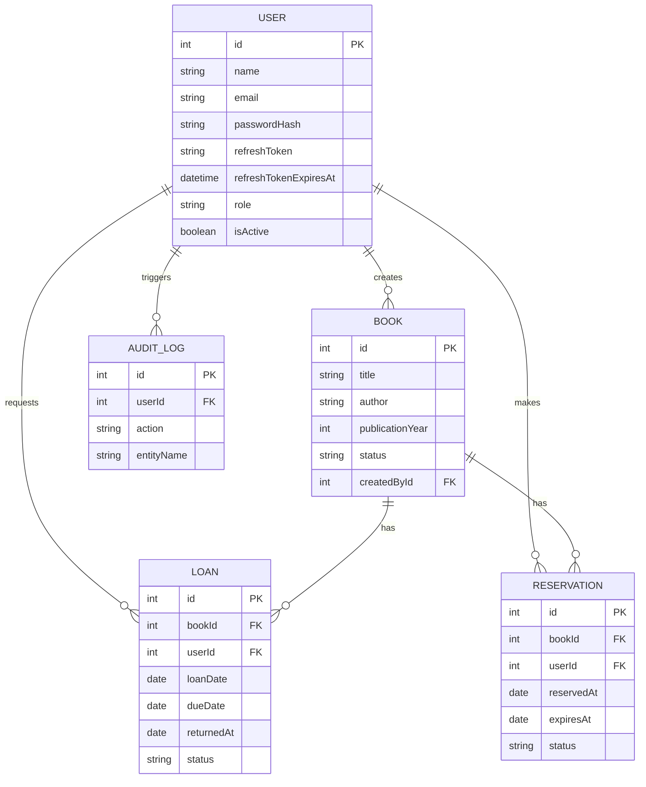

# LibraryFlow API

LibraryFlow is a robust, production-ready API built with **NestJS**, **Prisma**, and **SQL Server**. It provides a comprehensive library management system with a focus on security, professional architecture, and high test coverage.

## ✨ Key Features

- **Advanced Authentication**:
  - JWT Access Tokens (15 min expiry).
  - **HttpOnly Cookie** based Refresh Tokens for enhanced security.
  - Automatic Token Rotation and session management.
- **Library Management**: 
  - Complete CRUD for Books with pagination and status filtering.
  - Loan and Reservation management with automatic queue handling.
- **Audit System**: Automatic request/response auditing via NestJS Interceptors.
- **Professional Architecture**: SOLID principles, modular design, and service abstractions.
- **80%+ Test Coverage**: Comprehensive Unit and E2E test suites.

## 🏛 Architecture & Design Patterns

The application follows a clean modular architecture:
1. **Module Pattern**: Cohesive domain separation (`Auth`, `Books`, `Loans`, `Users`, `Logger`).
2. **Service Abstraction**: Critical logic (like `PasswordService`) is abstracted to ensure 100% testability and ESM compatibility.
3. **Interceptor Pattern**: `AuditInterceptor` for seamless cross-cutting concerns.
4. **Strategy Pattern**: Passport-based JWT strategies for decoupled authentication.

### Entity Relationship Diagram (ERD)


## 🚀 Setup & Execution

### Prerequisites
- **Node.js**: v20 or v22 (Recommended for ESM support)
- **Docker**: For SQL Server container
- **Package Manager**: npm

### 1. Database Setup
```bash
docker-compose up -d
npx prisma db push
npm run seed
```

### 2. Environment Variables (.env)
```env
DATABASE_URL="sqlserver://localhost:1433;database=LibraryFlow;user=sa;password=Password123;encrypt=true;trustServerCertificate=true;"
JWT_SECRET="YourSuperSecretJWTKey123"
PORT=3000
NODE_ENV=development
```

### 3. Running the Server
```bash
npm install
npm run start:dev
```

## 📚 API Documentation (Swagger)
Explore and test the API at:
👉 **[http://localhost:3000/api-docs](http://localhost:3000/api-docs)**

### Authentication Flow
1. **Login**: `POST /auth/login` - Returns `access_token` and sets an **HttpOnly** `refresh_token` cookie.
2. **Refresh**: `POST /auth/refresh` - Extends session using the secure cookie.
3. **Guard**: Protect endpoints with `@UseGuards(JwtAuthGuard)`.

## ✅ Quality Assurance

### Testing Commands
- **Unit Tests**: `npm run test`
- **E2E Tests**: `npm run test:e2e`
- **Coverage**: `npm run test:cov`

### Coverage Status
Target achieved: **80%+ Total Project Coverage**.
All core services and controllers are fully tested against edge cases.
