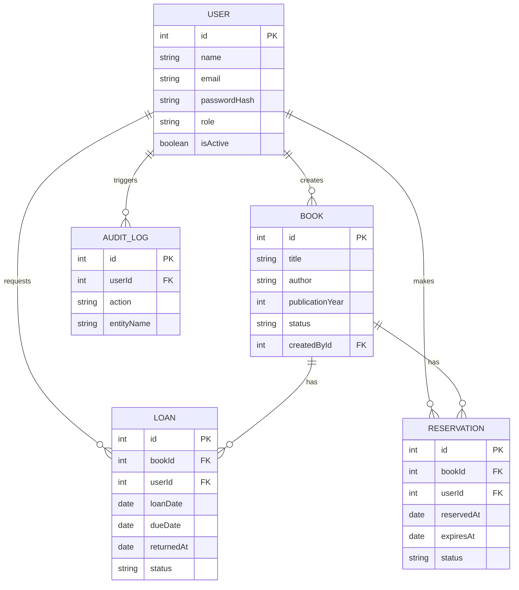

# LibraryFlow API

LibraryFlow is a robust API built with **NestJS**, **Prisma**, and **SQL Server** for comprehensive library management. It provides functionalities for authentication, book cataloging, making loans, reservations, tracking system audits, and a simple setup process.

## 🏛 Architecture & Design Patterns

The application follows NestJS's modular architecture using Dependency Injection (DI) and several key design patterns:
1. **Module Pattern**: Domain separation into cohesive modules (`Auth`, `Books`, `Loans`, `Users`, `Logger`).
2. **Repository/DAO Pattern (via Prisma)**: Abstraction over database communication.
3. **Interceptor Pattern**: The `AuditInterceptor` captures request lifecycles to trace mutations across critical paths seamlessly without duplicating logic.
4. **Decorator Pattern**: NestJS extensively uses decorators for routing and injecting guards.
5. **Strategy Pattern**: JWT Authentication leverages Passport strategies decoupling logic.

### Entity Relationship Diagram (ERD)


## 🚀 Setup & Execution

### Prerequisites
- Node.js (v18+)
- Docker (for SQL Server containerized environment)
- npm or yarn

### 1. Database Setup
A `docker-compose.yml` file is provided to spin up SQL Server locally.
```bash
docker-compose up -d
```
Then apply Prisma migrations or sync the schema:
```bash
npx prisma db push
# Or to apply seed data
npm run seed
```

### 2. Environment Variables (.env)
Ensure your `.env` contains the required variables:
```env
DATABASE_URL="sqlserver://localhost:1433;database=LibraryFlow;user=sa;password=Password123;encrypt=true;trustServerCertificate=true;"
JWT_SECRET="YourSuperSecretJWTKey123"
PORT=3000
```

### 3. Running the Server
Install dependencies and run:
```bash
npm install
npm run start:dev
```

## 📚 API Documentation (Swagger)
The API documentation is fully generated using Swagger. Once the server is running, you can explore, test, and authenticate using the UI at:
👉 **[http://localhost:3000/api-docs](http://localhost:3000/api-docs)**

### Key Functionalities
- **Auth**: `POST /auth/register` | `POST /auth/login`
- **Books**: `GET`, `POST`, `PATCH`, `DELETE` (`/books`) (Supports Pagination: `?page=1&limit=10`, Filtering: `?status=AVAILABLE`)
- **Loans**: `POST /loans/reserve` | `POST /loans/loan` | `PATCH /loans/return/:id`

## ✅ Running Tests
Jest is configured to run unit and e2e tests natively.
```bash
npm run test:e2e
```
